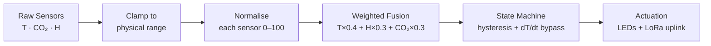
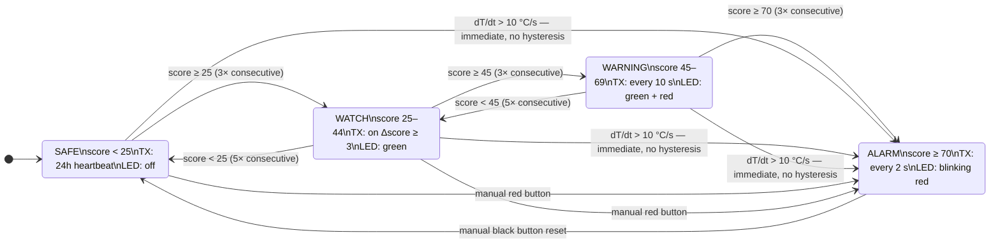
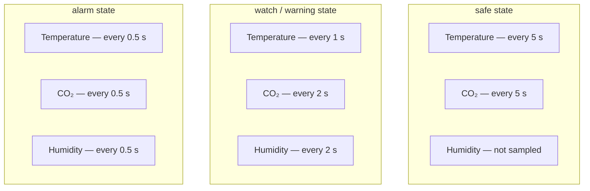
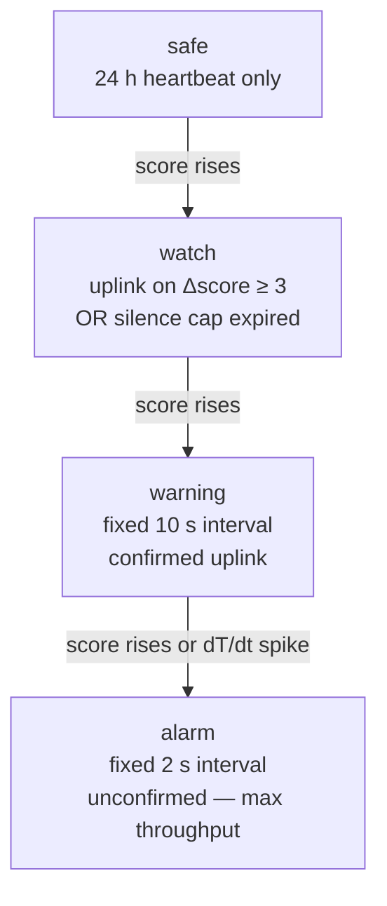

# Smart Forest Fire Alarm — TTN IoT Node

A battery-aware, edge-intelligent fire detection node built on the **HAN IoT Shield (ATmega32U4)** with an **SX1276 LoRa radio**, transmitting over **The Things Network (EU868)**. All fire-risk logic runs on-device — no cloud round-trip is needed before an alarm is raised.

---

## Hardware

| Component | Detail |
|-----------|--------|
| MCU | ATmega32U4 (Arduino Leonardo / HAN IoT Shield) |
| Radio | SX1276 LoRa — `Serial1` @ 57 600 Bd |
| Temperature | `iotShieldPotmeter(PIN_POT_RED, -175, 300)` — simulates −17.5 → 30 °C |
| Humidity | Derived from temperature in firmware — no physical sensor |
| CO₂ | `iotShieldCO2Sensor` — MQ135-based; simulated ramp in current build |
| Manual alarm | `iotShieldButton(PIN_SWITCH_RED)` |
| Manual reset | `iotShieldButton(PIN_SWITCH_BLACK)` |
| LEDs | 4 × `iotShieldLED` encoding state + TX pulse |

> **Note on humidity:** humidity is not independently sensed. It is computed as
> `H = 80 − (T − 25) × 0.7`, which models the inverse relationship between
> temperature and relative humidity during a fire. A DHT22 or SHT31 would replace
> this derivation with a real reading.

---

## Compile-Time Modes

Two mutually exclusive modes are enforced by `#error` guards:

```cpp
#define DEMO_MODE        // short intervals for live lab demonstration
// #define PRODUCTION_MODE  // EU868-compliant intervals for deployment
```

Only TX intervals change between modes. The state machine, scoring model, payload
format, and all sensing logic are identical.

| Interval | DEMO_MODE | PRODUCTION_MODE |
|----------|-----------|-----------------|
| Safe heartbeat | ~65 s | 24 h |
| Watch silence cap | 60 s | 2 min |
| Warning TX | 30 s | 10 s |
| Alarm TX | 5 s | 2 s |

---

## Edge Intelligence Pipeline



All processing happens on the ATmega32U4. The node computes a single composite
score and uplinks only when there is something worth reporting.

---

## Composite Scoring Model

Each sensor is normalised to 0–100 and fused into a single fire-risk score:

```
score = (tScore × 0.4) + (hScore × 0.3) + (cScore × 0.3)
```

| Component | Formula | Weight |
|-----------|---------|--------|
| Temperature | `constrain((T − 30) / 70, 0, 1) × 100` | 40 % |
| Humidity (inverted) | `constrain((50 − H) / 50, 0, 1) × 100` | 30 % |
| CO₂ | `constrain((CO₂ − 400) / 600, 0, 1) × 100` | 30 % |

| Score | State |
|-------|-------|
| < 25 | `safe` |
| 25 – 44 | `watch` |
| 45 – 69 | `warning` |
| ≥ 70 | `alarm` |

---

## State Machine



**Hysteresis rules:**
- **Escalation:** 3 consecutive readings above the next threshold → transition up, counter resets
- **De-escalation:** 5 consecutive readings below the current threshold → transition down (blocked while `alarmActive`)
- **Fast-rise bypass:** `dT/dt > 10 °C/s` → immediate jump to `alarm` from any state, no counter needed
- **Alarm lock:** `alarm` → `safe` requires the black button to physically clear `alarmActive`

---

## Sensing Intervals

Intervals are state-dependent, returned by `getTempInterval()`, `getCO2Interval()`,
and `getHumidityInterval()`. Humidity is not sampled in `safe` state.



---

## Rate-of-Rise (dT/dt)

Temperature samples are stored in a **5-entry circular buffer** with millisecond
timestamps. Rate of change is computed between the oldest and newest entries:

```
dT/dt = (T_newest − T_oldest) / (t_newest − t_oldest)   [°C/s]
```

Result is clamped to ±15 °C/s. If the time window is zero (buffer not yet full),
returns 0.

**Fast-rise trigger:** `dT/dt > 10 °C/s` → immediate escalation to `alarm`,
bypassing all hysteresis counters. `dT/dt` is encoded in `warning` and `alarm`
payloads as `int16 × 100` (two decimal places of precision).

---

## Baseline Buffer

A **12-entry circular buffer** of `SensorSample` records safe-state readings every
5 minutes, giving a 1-hour rolling picture of normal conditions:

```cpp
struct SensorSample {
  float         temperature;   // 4 B
  float         co2;           // 4 B
  float         score;         // 4 B
  unsigned long timestamp;     // 4 B  (millis())
};                             // 16 B × 12 = 192 B total
```

The buffer is **populated only in `safe` state** — it represents what normal looks
like, not elevated conditions. On `safe → watch` escalation, `delta_score`
(current score minus the 1-hour average) is included in the watch payload so the
backend can distinguish a slow 40-minute smolder from a 30-second sensor spike.

---

## LoRaWAN Uplink Strategy



### Watch change-detection logic

In `watch` state the node only uplinks when:
- the score has shifted by ≥ 3 points since the last TX, **or**
- the silence cap has expired (2 min production / 60 s demo)

This reduces watch uplinks by ~75 % vs a fixed interval (≤ 30/hr vs 120/hr)
without losing responsiveness to a developing situation.

### Warning uses confirmed uplinks

An ACK failure in `warning` state is treated as a signal of link degradation
*before* the situation becomes critical, giving the operator an early warning of
connectivity loss.

### Alarm intentionally exceeds TTN Fair Use Policy

At 2 s intervals and ~50 ms/frame, `alarm` generates ~90 s airtime/hr, exceeding
the TTN FUP limit of 30 s/day. This is a deliberate trade-off: in an active fire,
maximising data throughput before the hardware is destroyed takes priority over
network policy. A private LoRaWAN server (e.g. ChirpStack) removes this constraint.

### Duty Cycle Summary (EU868, SF7)

| State | Uplinks/hr | Airtime/hr | Duty cycle |
|-------|-----------|------------|------------|
| `safe` | ~0.04 avg | ~2 ms/day | < 0.0001 % |
| `watch` | ≤ 30 | ~1.5 s | ~0.04 % |
| `warning` | 360 | ~18 s | ~0.5 % |
| `alarm` | 1 800 | ~90 s | **~2.5 %** ⚠️ |

---

## Uplink Payload Format

All payloads share a common byte 0:
- **Upper nibble:** payload version (`0x1_`)
- **Lower nibble:** state (`0`=safe · `1`=watch · `2`=warning · `3`=alarm)

| Port | State | Byte 0 | Size | Fields |
|------|-------|--------|------|--------|
| 0 | Announce | — | 9 B | `node_id (uint8)` · `lat×10000 (int32)` · `lon×10000 (int32)` |
| 1 | Safe | `0x10` | 1 B | Header only — ACK = watchdog linkcheck |
| 2 | Watch | `0x11` | 7 B | `score (uint8)` · `temp×10 (int16)` · `CO₂ ppm (uint16)` · `Δscore (int8)` |
| 3 | Warning | `0x12` | 10 B | + `humidity% (uint8)` · `dT/dt×100 (int16)` · `reserved (0x00)` |
| 4 | Alarm | `0x13` | 11 B | + `trigger bitmask (uint8)` · `alarmActive (uint8)` |

**Trigger bitmask (port 4, byte 9):**

| Bit | Flag | Meaning |
|-----|------|---------|
| `0x01` | `TRIGGER_SCORE` | Composite score ≥ 70, confirmed by hysteresis |
| `0x02` | `TRIGGER_RATE` | `dT/dt > 10 °C/s` fast-rise bypass |
| `0x04` | `TRIGGER_MANUAL` | Red button pressed by operator |

Port 0 (announce) is sent once on boot, registers `NODE_ID` + GPS coordinates in
the Node-RED global context, and survives dashboard restarts. It does not carry the
version nibble.

---

## LED Encoding

| State | Left Green | Left Red | Right Red | Right Green |
|-------|-----------|----------|-----------|-------------|
| `safe` | OFF | OFF | OFF | OFF |
| `watch` | ON | OFF | OFF | OFF |
| `warning` | ON | OFF | ON | OFF |
| `alarm` | BLINK 500 ms | — | OFF | OFF |
| Any TX | — | — | — | Pulses ON → OFF |

The right green LED pulses briefly on every uplink across all states, providing a
visual TX heartbeat.

---

## Node Identity & GPS

Each physical node is assigned a unique ID and coordinates at flash time:

```cpp
#define NODE_ID   0x01
#define NODE_LAT  519849L   // 51.9849 °N × 10000  (~10 m precision)
#define NODE_LON   59539L   //  5.9539 °E × 10000
```

Sent on startup via port 0. The Node-RED dashboard uses this to place and label the
node on the Leaflet map.

---

## Sensor Clamp Ranges

Values outside these ranges are physically implausible or indicate sensor failure.
Clamping prevents garbage from corrupting the score or payload encoding. These
ranges **must match** the Node-RED decoder.

| Sensor | Min | Max |
|--------|-----|-----|
| Temperature | −20 °C | 120 °C |
| CO₂ | 300 ppm | 5 000 ppm |
| Humidity | 0 % | 100 % |
| dT/dt | −15 °C/s | +15 °C/s |

---

## Known Gaps & Future Work

1. **Real humidity sensor** — replace the temperature-derived value with a DHT22 or SHT31. The scoring formula and payload format already support it.
2. **Real CO₂ / particulate sensor** — the current `iotShieldCO2Sensor` simulates a physics-based ramp. CO₂ alone cannot distinguish fire from cooking or human respiration; a PM2.5 particulate sensor alongside CO₂ significantly improves specificity.
3. **Battery voltage ADC** — one ADC read per cycle included in the heartbeat payload enables remote battery health monitoring at zero extra airtime cost.
4. **dT/dt threshold tuning** — 10 °C/s is a hard confirmation threshold appropriate for structural fires. A lower warning threshold (e.g. 0.2 °C/s) in `warning` state would catch slower-developing fires earlier. Tune against real sensor data before deployment.
5. **Private LoRaWAN server** — moving to ChirpStack or similar removes the TTN Fair Use Policy constraint in `alarm` state and allows unrestricted uplink rates.
